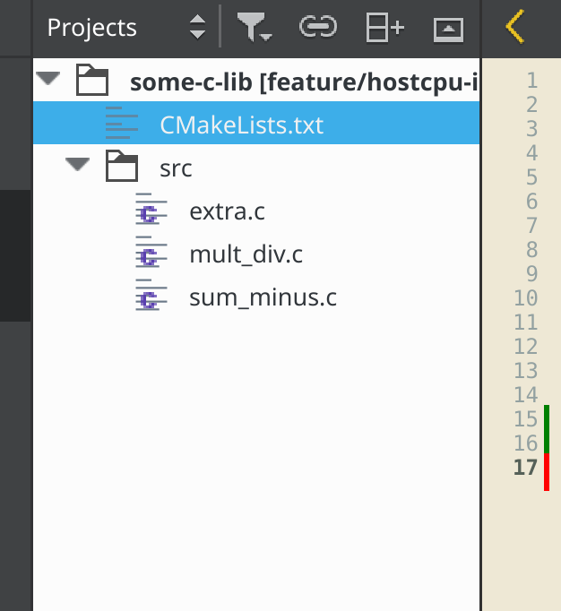
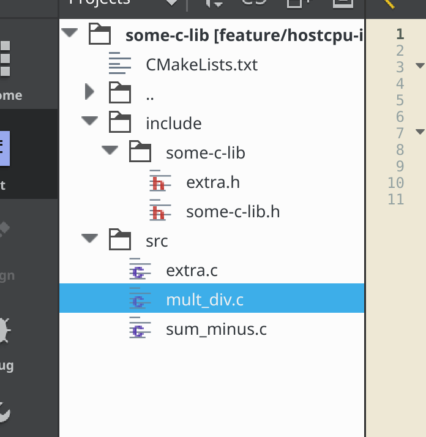

# target\_add\_ide\_support()
It is a common issue that CMake generated IDE projects for Visual Studio, QtCreator or CodeBlocks doesn't show the project headers or possibly aren't capable to index the symbols because of cmake not formwarding the informations.

With this Cmake Module it is pretty easy to make QtCreator or Visual Studio shows all the sources, headers and let the definitions be clickable.

For example, [this following project](./example/) : 

```
├── CMakeLists.txt
├── include
│   └── some-c-lib
│       ├── extra.h
│       └── some-c-lib.h
└── src
    ├── extra.c
    ├── mult_div.c
    └── sum_minus.c
```

```cmake
cmake_minimum_required(VERSION 3.7.2)

project(some-c-lib VERSION "0.0.10")

add_library(some-c-lib 
  src/extra.c
  src/mult_div.c
  src/sum_minus.c
)

target_include_directories(some-c-lib PRIVATE 
  include/
)
```

To have everything visible in IDE, just add the following call :

```cmake
include(add_ide_support.cmake)
target_add_ide_support(some-c-lib)
```

## Without target\_add\_ide\_support


## With target\_add\_ide\_support

